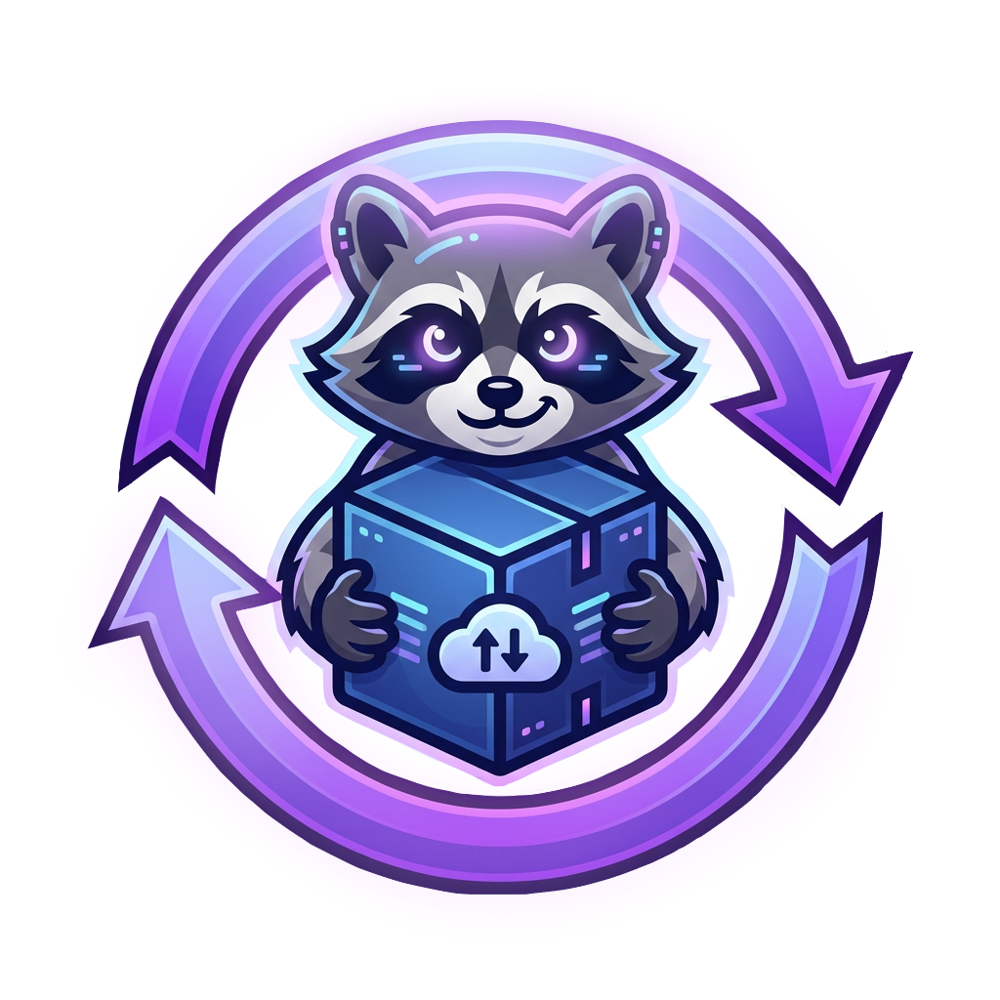
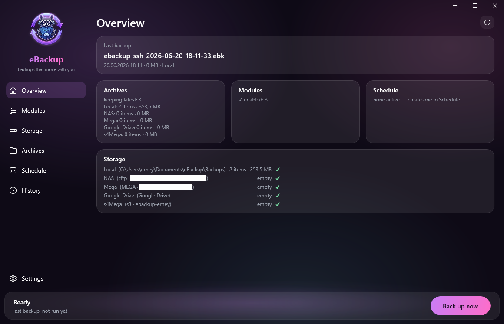

<p align="center">
  
</p>

<h1 align="center">eBackup</h1>

<p align="center"><b>Backups that move with you.</b></p>

<p align="center">
  <a href="https://github.com/erneywhite/eBackup/releases/latest"></a>
  <a href="https://github.com/erneywhite/eBackup/releases"></a>
  <a href="LICENSE"></a>
  
  
</p>

<p align="center">🌐 <a href="README.md">Русский</a> · <b>English</b></p>

---

**eBackup** backs up application settings and any folders you pick, stores archives in several
places at once — from a local folder or NAS to Google Drive, Dropbox and MEGA — and carefully
puts everything back, even on another computer or after an OS reinstall. A bilingual
(English / Russian) branded dark UI, a background service and a full CLI.

Free, open source, no subscriptions or paywalls. If eBackup came in handy, you can
[buy the author a coffee ☕](https://dalink.to/toristarm).

## Why eBackup

- 🗄️ **8 storage types at once** — local folder, NAS, SFTP, FTP/FTPS, S3, WebDAV, Google Drive, Dropbox, MEGA. One backup, several destinations.
- 🛡️ **Background service** — backups and schedules run even when nobody is logged in, with no window open.
- 🔐 **AES-256-GCM encryption** — archives are safe to put even on a server you don't own.
- ✅ **Every backup is verified** — the archive is re-read and checked against SHA-256; corrupted data never reaches any storage.
- 🧩 **Modules and a catalog** — OBS, VTube Studio, browsers, games and more; one-click install.
- 📦 **Portable `.ebk` format** — paths inside the archive are tokenized, so restore works on any PC.
- 🌍 **English and Russian** — switch the language in one click (Settings → Language); the whole UI is translated, and even the background service writes its log in the chosen language.

## Install

Download the installer from the [**Releases**](https://github.com/erneywhite/eBackup/releases/latest)
page (`eBackup-setup-x.y.z-x64.exe`) and run it. The app is **self-contained** — no .NET needed.
After install, eBackup checks for updates and can update itself with one click.

A background **eBackup** service (LocalSystem, auto-start) is installed alongside the app — it's
what lets backups and schedules run without an open window and even with nobody logged in.
Uninstalling the app removes the service too.

> Windows 10/11 (x64). Installing into Program Files needs administrator rights.

## How it looks

The main dashboard — "Overview": your latest backup, storages with their status, and one-click backup.



## Storage

As many as you like at once. Each gets a Test button, automatic availability badges ✓/✕ and a
used-space counter on the Overview.

| Kind | Details |
|---|---|
| 📁 Folder / network drive | UNC paths `\\nas\share`, optional SMB credentials (temporary connection) |
| 🔑 SFTP | password or a private key pasted **as content**; remote folder picking via a **tree** |
| 📡 FTP / FTPS | FluentFTP; self-signed NAS certificates allowed via an explicit flag |
| 🪣 S3-compatible | AWS S3, MinIO, Backblaze B2, Cloudflare R2…; path-style, prefix "folders" |
| ☁️ WebDAV | Nextcloud, ownCloud, Yandex.Disk etc. (app passwords) |
| 🟢 Google Drive | OAuth via the browser; `drive.file` scope — the app sees **only its own** files |
| 🔵 Dropbox | OAuth; isolated app folder |
| 🔴 MEGA | sign in once (login + password + 2FA code), then via the saved session, schedules included |

## What it does

**Backup.** Modules and any custom folders, several destinations per run, optional encryption,
machine name in the archive name, compression level. Free space is checked before starting — a
clean refusal instead of a mid-copy crash. And a liquid water progress bar with honest physics 🌊

**Verification.** After every backup the archive is fully re-read (decompression checks CRC32),
files are matched against the manifest by SHA-256, and each destination is verified by size.
Corrupted data never reaches a storage.

**Schedules.** Daily / weekdays / every N hours / **once a day when the PC is idle**. Each schedule
has its own modules, folders, destinations and encryption; there's a "Run now" button. The
background service runs them — they fire **even when nobody is logged in**, no need to keep the app
open. Encrypted schedules run on their own too (the service keeps the passphrase under a machine key).

**Restore.** To the original locations or any folder; conflict modes (replace with `.bak` /
overwrite / add missing only). External OBS scene assets land wherever you choose, and the paths
inside the scenes are rewritten automatically.

**Archives and browser.** Listings across all storages (size, date, 🔒 for encrypted). "Open" shows
a checkbox tree of the contents: restore selected files or just download them into a folder. Remote
archives are read **in ranges** (SFTP seek / HTTP Range): a 100 GB cloud archive opens its table of
contents in seconds, and only the selected files are downloaded.

**History.** A journal of every operation (manual and scheduled backups, restores, extractions).
Each run keeps a full log with millisecond timecodes: every file with its size, per-target upload
speed, verification, errors. Interrupted runs are honestly marked.

**Little things.** Result notifications (✅/❌), tray and autostart with Windows, keep-last-N
retention on every destination, temp cleanup, quick links to configs and logs.

## Security

- 🔐 **Archive encryption** — chunked AES-256-GCM, key derived from the passphrase via **Argon2id**.
- 🔑 **Connection secrets** (passwords, keys, OAuth tokens, the MEGA session) are stored encrypted
  and intentionally **not portable** to another PC: the service keeps them under a machine key, the CLI uses Windows DPAPI.
- 🚫 **Fail-closed** — the passphrase travels as a single-use ticket and never lands in logs or history; no passphrase, no archive.
- 🛡️ Archives are checked against path traversal, and every backup is verified before it ships.

**The `.ebk` format** is a ZIP + `manifest.json` with tokenized paths (`{APPDATA}` etc.), so the
archive is portable between machines. Names are descriptive and sortable:
`ebackup_MY-PC_obs_2026-06-19_19-40-01.ebk`.

## Modules

A module describes *what* to back up for a given app — no hand-picking dozens of folders.

- 🎬 **Built-in** (with smart install discovery): **OBS Studio** (config without caches, plugins
  and dependent scene assets) and **VTube Studio** (models, items, backgrounds and configs; finds
  the game in any Steam library, skips the heavy trackers).
- 🧩 **Catalog** — "Modules → Catalog" inside the app: SSH, VS Code, Minecraft, Vintage Story,
  Firefox, Waterfox… One-click install, the list lives in this repository.
- 📝 **Your own declarative modules** — drop a `*.module.json` into `%APPDATA%\eBackup\modules`
  (or `ebackup module-add file`), and the app starts backing up the described paths. No code, no rebuild:

```json
{
  "id": "myapp",
  "displayName": "My App",
  "entries": [
    { "tokenPath": "{APPDATA}/MyApp", "type": "Directory",
      "archivePath": "config", "excludeGlobs": ["**/Cache/**"] }
  ]
}
```

Want to share a module with others — add it to the [catalog](catalog/) via a pull request.

## CLI

Everything is scriptable: `backup`, `restore`, `storage-list` / `storage-test` / `storage-ls`,
`module-add`. The passphrase for automation goes through the `EBACKUP_PASSPHRASE` environment variable.

## For developers

You need the [.NET SDK 9.0+](https://dotnet.microsoft.com/download) (Windows 10/11).

```powershell
dotnet build eBackup.sln
dotnet test  eBackup.sln
```

| Project | Purpose |
|---|---|
| `eBackup.Abstractions` | Plugin contract (interfaces, manifest model) — a stable boundary |
| `eBackup.Core` | Backup/restore engine with verification, encryption, module registry, schedules, history |
| `eBackup.Security` | Secret protection: Windows DPAPI (CLI) and the service's machine key |
| `eBackup.Storage` (+ `.Sftp`, `.Local`) | Unified storage model, OAuth (PKCE + loopback), ranged reads of remote archives |
| `eBackup.Modules.Obs`, `eBackup.Modules.VTubeStudio` | Built-in modules with smart discovery |
| `eBackup.Ipc` | Named-pipe contract and transport between the GUI and the service |
| `eBackup.Localization` | Service/core strings (RU/EN): .resx + ResourceManager (the GUI is localized via resw + x:Uid) |
| `eBackup.Service` | The LocalSystem background service: all privileged work |
| `eBackup.App` | WinUI 3 GUI — a thin client of the service |
| `eBackup.Cli` | Command-line interface |

More about the design — in [docs/ARCHITECTURE.md](docs/ARCHITECTURE.md) (in Russian).

## License

[MIT](LICENSE) © Erney White ([@erneywhite](https://github.com/erneywhite))
