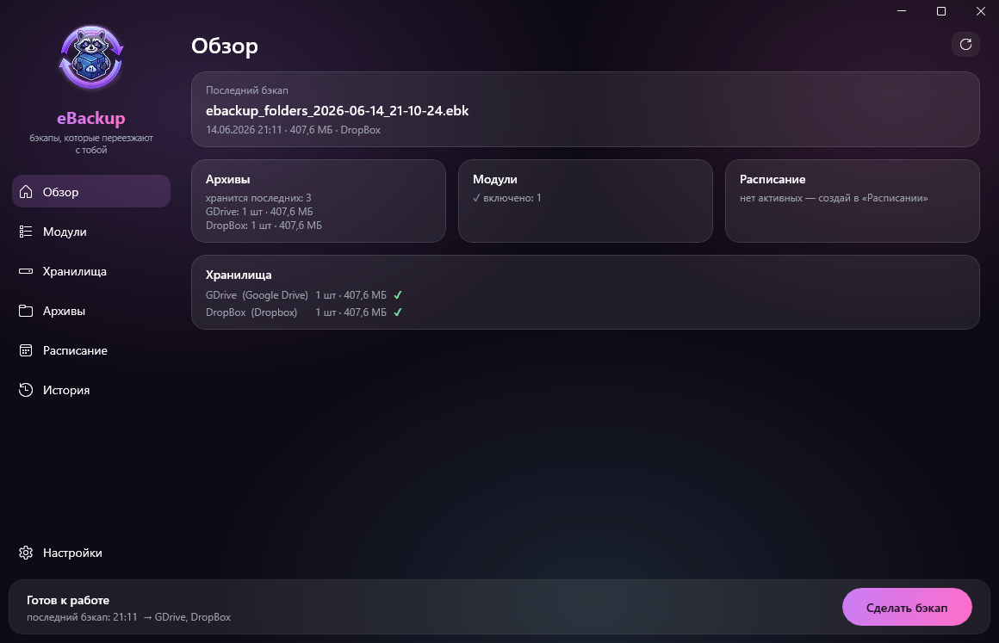

# eBackup

> 🌐 **Languages:** **Русский** (этот файл) · [English](README.en.md)

**eBackup** — модульное приложение для Windows, которое бэкапит настройки приложений
и любые ваши папки, хранит архивы сразу в нескольких местах — от локальной папки и
NAS до Google Drive — и аккуратно раскладывает всё обратно: даже на другом
компьютере или после переустановки ОС. Тёмный фирменный интерфейс + полноценный CLI.

Бесплатно, с открытым кодом и без подписок. Если eBackup оказался полезен —
можно [угостить автора кофе ☕](https://dalink.to/toristarm).

> 🎉 **Версия 1.1.0** — каталог модулей с установкой в один клик, отмена бэкапа и другие
> улучшения. Всё описанное ниже работает; впереди — фоновая служба бэкапа (1.2).

## Установка

Скачайте установщик со страницы [**Releases**](https://github.com/erneywhite/eBackup/releases/latest)
(`eBackup-setup-x.y.z-x64.exe`) и запустите его. Приложение **self-contained** —
.NET ставить не нужно. После установки eBackup сам проверяет обновления и умеет
обновляться одной кнопкой.

Windows 10/11 (x64). Установка в Program Files требует прав администратора.

## Скриншоты

Главный экран — «Обзор»: последний бэкап, хранилища с их статусом и запуск бэкапа в один клик.



<!-- Дополнительные экраны (Бэкап, Хранилища, История) добавим позже в docs/screenshots/. -->

## Хранилища — 7 типов, сколько угодно одновременно

| Тип | Детали |
|---|---|
| 📁 Папка / сетевой диск | UNC-пути `\\nas\share`, опциональная SMB-авторизация (временное подключение, пароль в DPAPI) |
| 🔑 SFTP | пароль или приватный ключ, вставленный **содержимым** (хранится зашифрованным); выбор удалённой папки **деревом** |
| 📡 FTP / FTPS | FluentFTP; самоподписанные сертификаты NAS допускаются |
| 🪣 S3-совместимые | AWS S3, MinIO, Backblaze B2, Cloudflare R2…; path-style адресация, префиксы-«папки» |
| ☁️ WebDAV | Nextcloud, ownCloud, Яндекс.Диск и др. (пароли приложений) |
| 🟢 Google Drive | OAuth-вход через браузер; scope `drive.file` — приложение видит **только свои** файлы |
| 🔵 Dropbox | OAuth-вход; изолированная папка приложения |

У каждого хранилища — кнопка «Тест», автопроверка доступности ✓/✕ и
счётчик занятого места на «Обзоре».

## Возможности

**Бэкап:**
- модули (OBS Studio) + **любые свои папки**; несколько целей за один прогон
- опциональное шифрование; имя компьютера в имени архива; выбор степени сжатия
- ✅ **Верификация после каждого бэкапа**: архив перечитывается целиком
  (распаковка проверяет CRC32), файлы сверяются по SHA-256 с манифестом, на
  каждой цели контролируется размер (для папок — полный SHA-256 копии).
  Битые данные не доедут ни до одного хранилища.
- проверка свободного места **до** старта — понятный отказ вместо обрыва на середине
- «жидкий» прогрессбар: вода с честной физикой, всплесками и пузырьками 🌊

**Расписания:** ежедневно / по дням недели / каждые N часов / **раз в день при
простое ПК** (нет ввода и система не нагружена). У каждого расписания свой
набор модулей, папок, целей и шифрования; кнопка «Выполнить сейчас».
Работают, пока приложение запущено — хотя бы в трее.

**Архивы и браузер архива:**
- списки по всем хранилищам: размер, дата, 🔒 у зашифрованных; удаление с подтверждением
- **«Открыть»** — дерево содержимого архива с галочками: восстановить выбранные
  файлы по исходным путям **или просто скачать** их в любую папку
- удалённые архивы читаются **кусками** (SFTP seek / HTTP Range): у 100-гигового
  архива в облаке оглавление открывается за секунды, а скачиваются только
  выбранные файлы

**Восстановление:** в исходные места или в любую указанную папку; режимы
конфликтов (заменить с `.bak` / перезаписать / только недостающие); внешние
ассеты сцен OBS раскладываются в выбранную папку, а пути в сценах
переписываются автоматически.

**История:** журнал всех операций — бэкапы (ручные и по расписанию),
восстановления, извлечения. У каждого запуска полный лог с таймкодами до
миллисекунд: каждый файл с размером, скорость заливки по целям, верификация,
ошибки. Прерванные запуски честно помечаются.

**И по мелочи:** уведомления о результате (✅/❌), трей и автозапуск с Windows,
retention «хранить последних N» на всех целях, очистка временных файлов,
быстрые кнопки к конфигам/логам из настроек.

**CLI** — всё скриптуемо: `backup`, `restore`, `storage-list/test/ls`,
`module-add`; парольная фраза для автоматизации — через переменную окружения
`EBACKUP_PASSPHRASE`.

## Модули

- 🎬 **OBS Studio** (встроенный): конфигурация без кэшей и логов, плагины из
  папки установки, и **зависимые ассеты сцен** (фоны-картинки, видео и т.п.,
  лежащие вне OBS) — с переписыванием путей при восстановлении
- 🧩 **Декларативные drop-in модули**: положите `*.module.json` в
  `%APPDATA%\eBackup\modules` (или `ebackup module-add файл`) — и приложение
  начнёт бэкапить описанные пути. Без кода и пересборки.

```json
{
  "id": "myapp",
  "displayName": "My App",
  "entries": [
    { "tokenPath": "{APPDATA}/MyApp", "type": "Directory",
      "archivePath": "config", "excludeGlobs": ["**/Cache/**"] }
  ]
}
```

## Безопасность

- 🔐 Опциональное шифрование архива: **AES-256-GCM** по чанкам, ключ из
  парольной фразы через **Argon2id** — безопасно класть на чужие серверы
- 🔑 Секреты подключений (пароли, ключи, OAuth-токены) — через **Windows
  DPAPI**, в конфигах в открытом виде не лежат и намеренно **не переносятся**
  на другой ПК
- 🛡️ Декларативным модулям разрешены только app-data пути (никаких
  `.ssh`/ключей/Program Files), архивы проверяются от path-traversal,
  каждый бэкап верифицируется до отправки

**Формат архива `.ebk`** — ZIP + `manifest.json` с токенизированными путями
(`{APPDATA}` и т.п.), поэтому архив **переносим между компьютерами**. Имена
говорящие и сортируемые: `ebackup_MY-PC_obs-folders_2026-06-11_19-40-01.ebk`.

## Сборка и запуск

Требуется [.NET SDK 9.0+](https://dotnet.microsoft.com/download) (Windows 10/11).

```powershell
dotnet build eBackup.sln
dotnet test  eBackup.sln

# GUI
.\src\eBackup.App\bin\x64\Debug\net9.0-windows10.0.19041.0\win-x64\eBackup.App.exe

# CLI
dotnet run --project src/eBackup.Cli -- list-modules
dotnet run --project src/eBackup.Cli -- backup --out .\backups --encrypt
dotnet run --project src/eBackup.Cli -- restore --archive .\backups\<имя>.ebk --to C:\Temp\check
```

## Архитектура

| Проект | Назначение |
|---|---|
| `eBackup.Abstractions` | Контракт плагинов (интерфейсы, модель манифеста) — стабильная граница |
| `eBackup.Core` | Движок бэкапа/восстановления с верификацией, шифрование, реестр модулей, расписания, журнал «Истории» |
| `eBackup.Security` | Защита секретов через Windows DPAPI |
| `eBackup.Storage` | Единая модель хранилищ: папки/SMB, FTP/FTPS, S3, WebDAV, Google Drive, Dropbox; OAuth (PKCE + loopback); чтение удалённых архивов кусками |
| `eBackup.Storage.Sftp` | SFTP на SSH.NET (+ seek-потоки), `eBackup.Storage.Local` — базовый локальный провайдер |
| `eBackup.Modules.Obs` | Модуль OBS Studio (конфиг + плагины + ассеты сцен) |
| `eBackup.App` | GUI на WinUI 3 |
| `eBackup.Cli` | Консольный интерфейс |
| `eBackup.Tests` | Тесты |

Подробности — в [docs/ARCHITECTURE.md](docs/ARCHITECTURE.md).

## Дорожная карта

Сделано: ✅ релиз [v1.1.0](https://github.com/erneywhite/eBackup/releases/latest),
✅ каталог модулей (установка в один клик), ✅ отмена бэкапа, ✅ автообновление.

Впереди:
- Фоновая служба (Windows Service) — бэкап всегда с нужными правами, расписание без открытого окна (1.2)
- Динамические DLL-плагины (с моделью доверия и подписями)
- Бэкап ключей реестра Windows
- English UI
- Выборочное чтение **зашифрованных** архивов без полного скачивания

## Лицензия
[MIT](LICENSE) © Erney White (erneywhite)
